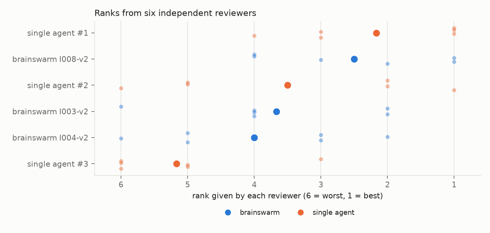
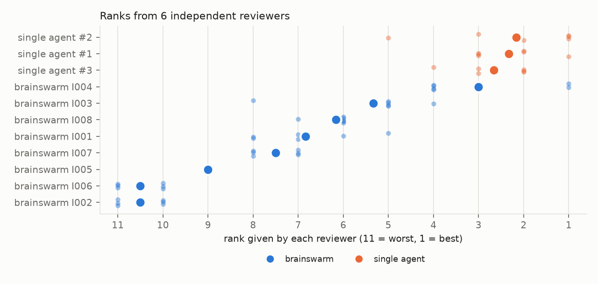

# Benchmark protocol

This protocol asks whether a brainswarm run produces better top ideas than a single strong
agent given the same brief. It is Phase 6, task 20 of [`PROJECT_PLAN.md`](../PROJECT_PLAN.md).

## Hypothesis

Let $Q(x)$ be a judge's score for idea $x$. For a brief $b$, let $S_b$ be brainswarm's top
$k$ finalists and $B_b$ the single agent's own top $k$. The claim under test is

$$
\mathbb E\big[\bar Q(S_b)\big] > \mathbb E\big[\bar Q(B_b)\big],
$$

where $\bar Q$ is the mean score of a set. The claim is judged against cost: a brainswarm run
used about 24x the new tokens of the baseline on the ETF brief (§ Cost), more with web research on, so a small quality gain may not be
worth it.

## Design

1. **Briefs.** 3–5 concrete briefs with stated constraints. The first three are the demo
   manifests in [`examples/demos/`](../examples/demos/). The exoplanet-transit and home-heating
   briefs were chosen because part of their quality is checkable by arithmetic (a photometric
   noise budget; a heat-loss calculation), which gives a measurable outcome alongside the
   human rating.
2. **Baseline.** One Opus agent per brief with the task in
   `benchmark/<brief>/baseline_task.md`: 20 ideas with a two-sentence pitch each, then its own
   top 3 developed into full cards. It has the same web setting as the brainswarm run and the
   same card fields and 400-word cap as brainswarm's workshopped finalists, so length and
   format do not favour either side. Each card must be self-contained: the first ETF baseline
   wrote "same harness as Idea 1", which revealed its origin, and was regenerated.
3. **Blinding.** `benchmark/make_pack.py` renders both top-3 sets in one card format without
   sources, ids or provenance, and shuffles them with a seed drawn from OS entropy by numpy.
   The seed and the label key go to `key.json`, which the judge opens only after rating.
   The builder refuses a pack whose cards mention an idea number or id (`Idea 1`, `I008`,
   `L0004`).
4. **Judging.** Every card is rated from 1 to 5 on constraint fit, drawdown (or the brief's
   main risk), growth (or the main objective), diversification (or breadth), and "would
   pursue", then all six are ranked. The default rater is a panel of six independent LLM
   reviewers (`benchmark/llm_review.py`): two each of Sonnet, Opus and Fable, each in a fresh
   read/write-only context, with card order counterbalanced by a 6x6 cyclic Latin square
   (every card once in every position) and letters reassigned per reviewer. A human rater
   (`pack.md`) remains the stronger check where one with domain knowledge is available,
   because both sides were written by Claude models and brainswarm's finalists were chosen
   by Claude judges, so LLM reviewers partly measure agreement with the system's own taste;
   the demo also showed LLM judges have a strong position bias
   ([`DESIGN.md` §10](DESIGN.md#10-scoring)).
5. **Analysis.** Per brief, the difference in mean "would pursue" score and the mean rank of
   each side. Across briefs, a sign test on the per-brief differences. With 3–5 briefs this
   detects only a large effect; the benchmark is a sanity check, not a precise estimate.

## Limitations

- **Style tells.** Workshopped brainswarm titles tend to be long and colon-separated, which a
  reader may learn to recognise, and developed cards can carry traces of the critique round
  ("conceded", "the old renormalising gate"). Both are kept verbatim because rewriting them
  would change content.
- **Selection.** Each side's top 3 is chosen by that side's own process, which is the
  intended comparison (what a user would receive), not a comparison of raw generation.
- **One rater.** A single rater's taste is confounded with the brief. More raters, or an
  outcome measured by arithmetic or backtest, would strengthen it.

## Status

| Brief | Brainswarm run | Baseline | Pack | Ratings |
|---|---|---|---|---|
| ETF strategy | recorded (`examples/demo-run/`) | done | [`benchmark/etf-strategy/pack.md`](../benchmark/etf-strategy/pack.md) | 6 LLM reviewers (below); no human rating |
| Improving brainswarm itself | recorded (`examples/runs/2026-09-29-beat-baseline/`) | done | all 8 finalists + 3 baseline cards | 6 LLM reviewers (below) |
| Exoplanet transit | shelved until usage allows | pending | pending | pending |
| Home heating | shelved until usage allows | pending | pending | pending |

## Results

### ETF strategy (2026-09-29)

*The six reviewers did not prefer either side. Each row is one card; small dots are the rank
each reviewer gave it (1 = best, right), and the large dot is the mean. Blue: brainswarm's
three finalists; orange: the single agent's own top three. The single agent's first choice has
the best mean rank (2.17) and its third choice the worst (5.17); brainswarm's cards sit in
between (2.50, 3.67, 4.00). The spread of dots within every row is wide: the reviewers agree
only weakly.*

| Measure | Brainswarm minus single agent | Reviewers favouring brainswarm | Sign test p |
|---|---|---|---|
| "Would pursue" (1–5) | 0.00 | 3 of 6 | 1.0 |
| Rank (lower is better) | −0.22 | 3 of 6 | 1.0 |

- **Agreement** between reviewers is weak: Kendall's $W = 0.33$ (0 = none, 1 = identical
  rankings).
- **Model effect:** both Opus reviewers preferred brainswarm (rank differences −3.00 and
  −1.00), both Fable reviewers preferred the single agent (+1.67, +3.00), and the Sonnet
  reviewers split. With two reviewers per model this is suggestive only.
- **Position:** the Spearman correlation between the order a card was shown in and its rank
  is 0.22 (cards shown earlier ranked slightly better); the Latin square spreads this evenly
  over both sides.
- **Reading.** On this brief, at this reduced size and with web research off, brainswarm's
  finalists were not rated better than a single strong agent's own top three, at about 24
  times the new-token cost. One brief is not a verdict on the method; the physically
  checkable briefs are the stronger test.

### Improving brainswarm itself (2026-09-30)

The brief of the self-run: ways to make a multi-agent idea system beat a single strong agent's
top 3. The same six-reviewer panel rated **all 8** brainswarm finalists and the single agent's
top 3 (11 cards; 6 rows of an 11x11 cyclic Latin square, so no card appeared twice in the same
position). The single agent had the same context the generators had (the brief and the
rubric's descriptions of the system and the benchmark), 20 ideas, and web off; its first card
was 409 words, 9 over the cap.

*The single agent won clearly. Each row is one card; small dots are the rank each reviewer gave
it (1 = best, right) and the large dot the mean. Blue: brainswarm's eight finalists; orange:
the single agent's top three. All three single-agent cards sit above every brainswarm card
except I004, and the dots in each row cluster tightly: the reviewers agreed.*

| Measure (brainswarm's own top 3 vs the single agent's) | Difference | Reviewers favouring brainswarm | Sign test p |
|---|---|---|---|
| "Would pursue" (1–5) | −1.17 | 0 of 6 | 0.06 |
| Rank of 11 (lower is better) | +3.89 | 0 of 6 | 0.03 |

- **Agreement** was strong: Kendall's $W = 0.92$ (against 0.33 on the ETF brief), and the
  position–rank correlation was 0.05, so order did not matter.
- **Brainswarm's internal ranking disagreed with the panel:** its #1 (I001) was 7th of 11 and
  its #3 (I005) 9th; its best card by the panel, I004, was its own #2.

### Selection rules tested offline (Stage 1)

`benchmark/experiments/selection_rules.py` re-picks brainswarm's top 3 from the run's own
finals verdicts under two proposed rules and scores the picks by the panel's "would pursue".

| Rule | Picks | Best of 3 | Mean of 3 |
|---|---|---|---|
| current (top 3 posterior modes) | I001, I004, I005 | 3.83 | 3.00 |
| portfolio: maximise $E[\max_{i\in S}\beta_i]$ (idea I003) | I001, I004, I005 | 3.83 | 3.00 |
| judge-reliability weighting, weights from the ETF brief (idea I008) | I001, I004, I008 | 3.83 | 3.28 |
| best possible of the 8 | I001, I003, I004 | 3.83 | 3.28 |
| a random set (mean of all 56) | | 3.27 | 2.65 |
| *single agent's own top 3* | | *4.33* | *4.17* |

The portfolio rule changed nothing on this run. Reliability weighting (Sonnet judges agreed
with the ETF panel on 44 % of verdicts, so weight 0; Opus 78 %, weight 0.56; Fable unseen, the
mean 0.28) reached the best possible mean, one brief of evidence. The main finding is the last
two rows: **even the best 3 of brainswarm's 8 ideas rate below every single-agent card**, so
on this brief the gap is in what was generated, not in which ideas were selected.

## Cost

The ETF baseline agent used 59k new tokens and 0.15M cache reads in one dispatch (the
regenerated, self-contained baseline about the same), against at
least 1.41M new tokens and 6.5M cache reads for the recorded brainswarm run (35 recovered
transcripts, web off): a ratio of about 24 in new tokens. Both are measured from subagent
transcripts with the same accounting (`usage.py`).
