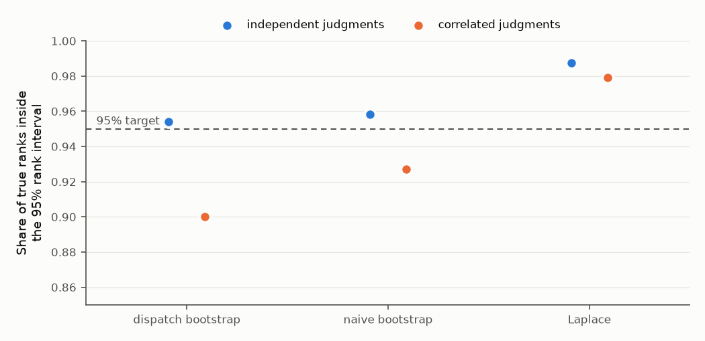

# brainswarm — design

> **Status: implemented (2026-09-29).** This document is the source of truth
> for what brainswarm is and how it works; it was revised after an
> independent design review (§21) and a coverage study (§10). Work is tracked in
> [`PROJECT_PLAN.md`](../PROJECT_PLAN.md); the repository overview is in the
> [README](../README.md). Where a decision is still open it says so explicitly
> in [§20](#20-open-questions).

## Contents

1. [Purpose](#1-purpose)
2. [Relationship to agent-evolve](#2-relationship-to-agent-evolve)
3. [Invocation and interaction](#3-invocation-and-interaction)
4. [Prime directives](#4-prime-directives)
5. [Pipeline](#5-pipeline)
6. [The two knobs: size and exploration](#6-the-two-knobs-size-and-exploration)
7. [Design fixation controls](#7-design-fixation-controls)
8. [Repeat runs and the idea library](#8-repeat-runs-and-the-idea-library)
9. [Outputs and export](#9-outputs-and-export)
10. [Scoring](#10-scoring)
11. [Storage and privacy](#11-storage-and-privacy)
12. [Security](#12-security)
13. [Architecture](#13-architecture)
14. [Logging and telemetry](#14-logging-and-telemetry)
15. [Watch list: known weak points](#15-watch-list-known-weak-points)
16. [Gaps and platform facts](#16-gaps-and-platform-facts)
17. [Demo](#17-demo)
18. [Build order](#18-build-order)
19. [Design history: what we took from prior art](#19-design-history-what-we-took-from-prior-art)
20. [Open questions](#20-open-questions)
21. [Design review](#21-design-review)
22. [References](#references)

---

## 1. Purpose

**brainswarm generates ideas at scale and ranks them honestly.** Given a
brief with guidelines ("come up with a strategy for trading stocks; it
should trade on many days and optimise for growth and diversification",
"think of ways to improve ___", "think of ways to solve ___"), it runs a
swarm of independent agents that research and propose ideas, has other
agents critique every idea with justified criticism, develops the most
promising and the most unusual ideas further, and ranks the results with
honest uncertainty.

**Output:** a ranked list of *every* idea with its full critique record, a
shortlist of the **top few idea families** (default 5, each with its closest
variants), labelled wildcards, and optional export bundles for follow-up work
(for example with agent-evolve).

**It is deliberately not:**

- a consensus or decision tool (it ranks many options; it does not converge
  on one answer),
- a literature survey,
- a code optimiser (that is agent-evolve),
- an actor: it never trades, edits code outside its own run folder, or
  publishes anything.

**Use-case shapes it must handle** (kept flexible, not hard-coded):

| Shape | Input | Downstream measurable? | Outside knowledge |
|---|---|---|---|
| Strategy design | a brief | often (e.g. a backtest) | some |
| Improve ___ | an artifact (repo, system, paper, process) | sometimes | mostly the artifact |
| Solve ___ | a problem statement | usually not | often |

Where a downstream measurement exists, brainswarm's ranking is a *"worth
testing"* prior, never a claim that the idea works.

## 2. Relationship to agent-evolve

**Independent tool, shared philosophy, compatible output** [[14]](#ref-agent-evolve). brainswarm does
the *coming up with ideas* part that agent-evolve is not designed for;
agent-evolve is good at testing and improving an idea once it is code.
Pairing: **brainswarm the ideas, evolve the code.**

- brainswarm never imports, calls, or requires agent-evolve.
- The only link is `brainswarm export`, which writes files (a draft
  `agent-evolve.yaml`, `hypotheses.md`, an implementation brief). That file
  set is the entire contract. If the `agent-evolve` CLI happens to be on
  PATH, export runs its `validate` as a courtesy; otherwise it skips with a
  note.
- Shared pieces (sandbox runner, usage parser, report styling) are **copied,
  not imported**. Extract a shared library only if a third tool appears.

Philosophy carried over from agent-evolve:

| agent-evolve | brainswarm |
|---|---|
| Hypothesis pre-registration | Rubric frozen and hashed before dispatch; raw ideas saved before research |
| "Never re-run an eval to shop for a better number" | "Never re-judge to shop for a verdict"; every judgment recorded |
| Negative-result ledger | Graveyard with reasons; known-false claims ledger |
| Adversarial reviewer ("if unsure, REJECT") | Harsh, stake-free critics whose critiques must be justified |
| mutate / crossover / explore operators | Workshop (mutate, graft from siblings) and explore-lens generators |
| Pareto front | Secondary quality × novelty view |
| No winner is a valid outcome | "Not separable" tiers are a valid outcome |
| Prompt rules also enforced in code | Same: blinding, swaps, rubric freeze, critique checks, scoring in code |

Notes from reading agent-evolve (none require changing agent-evolve):

- agent-evolve has **no manifest field for seed hypotheses**. Export works
  around this: reference `hypotheses.md` in the evolve prompt. An optional
  `seed_hypotheses:` field in agent-evolve would be a convenience, not a
  requirement.
- **Idea → code gap.** agent-evolve needs a runnable baseline; a brainswarm
  idea is text. Each export includes an implementation brief; the first
  working version is an ordinary coding step before evolve.
- agent-evolve's **sibling mode** (catalogues of strategy classes) fits
  "separate evolves on each of the top few ideas".
- In agent-evolve, metric inference is done by the *session* following
  SKILL.md (Phase 0, Path B); the Python package validates, parses, and
  applies. brainswarm keeps that split and tightens it (§5, Phase 0).

## 3. Invocation and interaction

- **Command:** `/brainswarm`, or say **"brainswarm …"** in prose, exactly
  like `/evolve` / "evolve …".
  - `brainswarm trading strategies that trade on many days and optimise growth and diversification`
  - `brainswarm ways to cut our CI time — quick, surprise me`
  - `/brainswarm path/to/brainswarm.yaml`
- **Deliberately distinctive trigger.** A standard run costs millions of
  tokens; the skill must **not** trigger on "brainstorm", "mull it over", or
  casual requests for a few ideas. The skill description says so
  explicitly.
- **Autonomous by default.** No questions unless the brief is unrunnable.
  Every assumption is written to an "Assumptions I made about your brief"
  log shown in the preflight card and the report.
- **Opt-in human checkpoint** after clustering (prune or steer before
  critique). Off by default.

**How the human receives information:**

1. **Preflight card** (chat): brief as interpreted, inferred rubric,
   assumptions, setting + exploration, token estimate. Shown, not asked;
   the user can interrupt.
2. **Progress**: one line per phase (`critique 14/20 · 3.1M tokens`), no
   agent chatter.
3. **Notification** on completion where the environment supports it.
4. **Digest** (chat, ~15 lines): top families as one-liners, wildcards,
   what changed vs last run, tokens used, a Limitations line only if
   something degraded, path to the report.
5. **Follow-up questions** in the same conversation, answered from the run's
   structured data ("why did 7 lose to 3?", "show every fatal critique of the
   options idea"). Pull, not push.
6. **Report files** in the run folder: `report.md` and a self-contained
   `report.html`. Publishing a hosted page is offered, never automatic.

## 4. Prime directives

Draft; will be carried into `SKILL.md` verbatim.

1. **The referee never contributes.** The session running `/brainswarm`
   never generates, critiques, workshops, or judges ideas.
2. **The rubric is frozen before dispatch.** Code refuses to judge if the
   rubric hash has changed.
3. **Generation is blind.** No generator sees another generator's ideas or
   the idea library.
4. **Rank, don't remove.** No idea is deleted. Only constraints the user
   stated (plus the default legality/ethics gate) can bar an idea from the
   shortlist, and barred ideas stay visible with the reason. Some stupid
   ideas are an acceptable price for not over-filtering.
5. **Every criticism is justified or carries no weight.**
6. **Never re-judge to shop for a verdict.** Every judgment is recorded.
7. **Numbers come from code.** Token counts, scores, and intervals are
   computed, never reported by a model.
8. **brainswarm recommends; it never acts.**
9. **Stop at the report.**

## 5. Pipeline

```
rubric draft -> audit -> freeze -> angle round -> angle clusters -> ideate (no web)
  -> research -> idea clusters -> [checkpoint] -> critique -> checker -> advocate
  -> workshop -> re-critique -> [fact-check] -> finals -> boundary -> report -> stop
```

### Control: a code-driven state machine

The referee (the session running `/brainswarm`) is a thin loop, so that the
protocol lives in code rather than in the referee's context (§21, review
items B3/B4):

1. `brainswarm next <run>` prints either a **referee action** (write the
   rubric draft, freeze it, or hold at the opt-in checkpoint) or a list of
   **dispatches**: role agent, model, and the exact prompt.
2. Each subagent reads its task file `tasks/<phase>/<id>.md`, writes one
   JSON object to `out/<phase>/<id>.json`, and replies with one line.
3. `brainswarm ingest <run>` validates every output against the phase's
   schema. An invalid output gets **one retry**, with the problems appended
   to its task file; a second failure **drops** that dispatch. A
   multi-dispatch phase continues if at least half its dispatches
   succeeded (below that the evidence is too thin to trust); a
   single-dispatch phase must succeed. Valid outputs become code-owned
   state under `data/`, and the phase advances.

All state is on disk and `next` is idempotent: after a compaction or crash
the referee runs `brainswarm status` and continues. The referee never opens
`tasks/` or `out/`. Every dispatch is launched with the description
`bs <run> <phase>/<id>`, which is how token usage is attributed (§14).

### Phases

| Phase | Role (dispatches at standard size) | Sees | Writes | Code then |
|---|---|---|---|---|
| audit | rubric-auditor (1) | brief, draft rubric | issues | stores; the referee revises the draft and runs `freeze` |
| angle round | ideator (20), no web | brief, rubric | 3 angles, 3 far domains with distance | assigns ids and proposers |
| angle clusters | clusterer (1) | all angles and domains, proposers hidden | partition into clusters | checks every id appears once; counts popularity; bands; assigns slots (§6) |
| ideate | ideator (20), no web | brief, rubric, own slot | 3 raw sketches | timestamps them: the pre-registration |
| research | generator (20), web <= 40 calls, sandbox | own sketches | 3 idea cards, each <= 400 words | ids; provenance from code, not from the agent |
| idea clusters | clusterer (1) | cards; library index | clusters; new / variant / repeat | checks the partition |
| critique | critic (~60, 6 cards each) | rubric; anonymised cards in random order; known-false ledger | justified critiques; top-3 overall and top-3 novelty rankings; 1-5 upside and probability | schema, quote match, "unproven" flag |
| checker | checker (~1 per 30 critiques) | each critique beside a random other idea from its batch | whether it transfers | generic and repetition flags; preliminary fit; gates; workshop slots |
| advocate | advocate (1) | ideas without a slot, with critiques | at most 2 promotions | adds slots |
| workshop | workshop (1 per slot; a model other than the author's) | idea, all its critiques, sibling ideas | version 2; a response to every counting major or fatal critique; grafts | checks all were answered; v2 is a new node |
| re-critique | critic (~6) | v1, v2, responses | whether each response holds; same-idea votes; new critiques | drift by majority; critic hit-rate data |
| fact-check | critic (1 per finalist), web runs only | finalist card | claim statuses | shown to judges |
| finals | judge (~(F x m)/10) | rubric; cards with critique record and fact-check | per ordered pair: preferred, reason | incomplete schedule; the two orders of a pair in different dispatches |
| boundary | judge | pairs from a pre-registered rule | as finals | ideas with P(top-k) in [0.2, 0.8] get 4 extra matches each |
| report | code | | | fits both strata, renders, updates the library |

### Framing (the referee's only creative work)

- The referee parses the request into a brief and the two knobs, asks
  nothing unless the brief is unrunnable, and records every assumption.
- **Gates**: only constraints the user stated, plus the required gate
  `legal_and_ethical`. Anything inferred is a judged criterion (code
  rejects inferred gates). A gate failure is *fatal* or *fixable*; a
  fixable one is answered in the workshop.
- **Judged criteria**: one per guideline in the brief, plus value,
  feasibility / specificity, and novelty, each with a definition and
  anchors. Criteria are compared pairwise, never scored on scales, so no
  weights are set.
- **Measured criteria**: only when the user supplies a way to measure;
  results are sanity checks.
- The rubric auditor's issues are advisory; the referee decides and then
  freezes (code hashes the rubric; judging refuses a changed hash).

### Justified critique

Code rejects items missing a field, flags the rest mechanically, and never
deletes a critique; flagged critiques are shown but carry no weight.

| Field | Rule |
|---|---|
| `target` | a quote from the card; fuzzy-matched by code (ratio >= 0.85) |
| `mechanism` | why it fails; "unproven" alone is flagged |
| `evidence` | citation, calculation, counter-example, or brief reference |
| `severity` | `fatal` / `major` / `minor`; optional `gate` |
| `falsifier` | what would show the critique wrong, or what fix answers it |

The checker's substitution test flags critiques that would be equally true
of another idea (generic); code flags a critic that makes nearly the same
point about three or more ideas (templated).

### Critic and finals designs

Both are generated by code from the run seed before any agent sees the
ideas, so they are pre-registered.

- **Critic batches**: an incomplete block design. Each idea appears in `r`
  batches of at most 6; batches are random, so they mix clusters; the
  co-review graph must be connected. The model of each batch is chosen to
  clash least with the authors' models.
- **Finals**: an incomplete round robin. Each finalist meets at least `m`
  opponents (6 / 8 / 12 by size). Both presentation orders of every pair
  are judged, in *different* dispatches (a context that saw one order
  would remember its verdict), at most 10 pairs per dispatch. **Crossover
  design:** each pair is assigned to one judge model, which judges it in
  both orders. Every model's verdicts then contain within-model order
  contrasts, which is what identifies the position bias $\gamma$ (§10).
  The first design sent the two orders to *different* models; with two
  judge dispatches, as in the demo, "each judge prefers the first-listed
  idea" and "the two judges disagree" then produce identical data, and the
  fit attributes all of it to $\gamma$. Runs recorded before the change
  keep the old design (`judge_design: split`) so they replay exactly.
- **Judge verdicts** name the winner by id (never "first" or "second"),
  give the strongest point of each idea, and cite the judged criterion
  that decided it.

## 6. The two knobs: size and exploration

Two independent axes. Any combination is valid (`quick + wild` = cheap
long-shot sweep; `deep + conservative` = thorough practical search). Plain
language maps to both ("quick but surprise me").

**Neither knob changes how ideas are critiqued, judged, or ranked.** The
ranking is always "value, judged neutrally", so runs stay comparable.

### Size — how much work (and tokens)

| Setting | Shape | New tokens | Cache reads | Rough wall time |
|---|---|---|---|---|
| `quick` | 8 generators, critique, light finals, no workshop | ~4–6M | ~17–29M | ~30 min |
| `standard` (default) | 20 generators, targeted-web critique, 12 workshop slots, re-critique, full finals | ~10–15M | ~44–68M | ~1–2 h |
| `deep` | 30 generators, 2 workshop rounds, 16 slots, 5-judge finals | ~16–23M | ~71–107M | ~3 h+ |

The new-token ranges come from `docs/studies/token_calibration.py`, which
models a run as $T = \sum_p n_p c_p$: $n_p$, the dispatches in phase $p$,
is counted exactly by a fixture-mode run of each preset (quick 74,
standard 178, deep 290 dispatches), and $c_p$, the new tokens per
dispatch, is measured from the transcripts of the demo and its reruns
(`token_calibration_measured.json`). Every phase was measured with web off,
so the web-heavy phases carry a range: research and fact-check at 50–120k
per dispatch (web-research subagents measured in the design session), and
critique from its measured 81k up to 131k. Critique dominates (60 of 178
dispatches at standard size). Cache reads are projected at 4.6 times new
tokens, the ratio measured on the demo. The referee session is not
counted. How subscription plans weight cache reads is not published, so
both numbers are reported. Wall times are guesses. The first calibration
(2026-09-29) raised every row: the earlier table rested on a usage count
that dropped repeated generator ids and retries (§14).

### Exploration — where the work goes (same token cost)

| | conservative | balanced (default) | wild |
|---|---|---|---|
| Generator slots: angle / free / cross-domain | 70 / 25 / 5 % | 50 / 25 / 25 % | 30 / 20 / 50 % |
| Assigned-angle bands: common / middle / rare | 60 / 30 / 10 | 34 / 33 / 33 | 15 / 35 / 50 |
| Analogy distance: near / mid / far | 60 / 30 / 10 | 34 / 33 / 33 | 15 / 35 / 50 |
| Workshop slots (standard): value / wildcard / deepen | 8 / 2 / 2 | 5 / 4 / 3 | 3 / 7 / 2 |
| Wildcards shown with the top 5 | 0–1 | 2 | 4 |

No band is ever zero: common angles may be common because they are good;
rare ones are where surprises come from. Free slots already lean common, and
the assignment accounts for that. The mix is a hypothesis; per-band results
are logged so defaults can be moved on evidence. v1 is deterministic (no
auto-tuning) so runs stay comparable. Near/far analogy research reports
mixed effects of analogical distance on design output
[[9]](#ref-fu-2013), which is why every distance band is sampled and
measured rather than one being chosen a priori.

### Banding and allocation

A cluster's popularity $s_k$ is the number of distinct generators that
proposed an angle in it; the clusterer groups the angles, and code counts.
Bands use fixed thresholds: **rare** $s_k = 1$, **middle**
$2 \le s_k \le 3$, **common** $s_k \ge 4$ (4 of ~20 generators is a clear
convergence; one proposer is by definition idiosyncratic). Tertiles were
rejected because most free-text angles form singleton clusters, which puts
both tertile cut points at 1 and empties the rare band (§21, review item
B4). Domains are banded by their proposers' majority distance rating
(near, mid, far).

Given $n$ assigned-angle slots and the knob's band shares $q_b$
($\sum_b q_b = 1$), band $b$ receives

$$
n_b = \lfloor n q_b \rfloor + \delta_b,
$$

where the $\delta_b \in \{0, 1\}$ give the remaining
$n - \sum_b \lfloor n q_b \rfloor$ slots to the bands with the largest
fractional parts (largest-remainder rounding), so $\sum_b n_b = n$ exactly
and each $n_b$ is within one slot of $n q_b$. A band with no clusters
passes its slots to the nearest non-empty band. Within a band, clusters
are drawn uniformly without replacement (so one popular cluster cannot
absorb a band's slots), and angles proposed by the receiving generator are
excluded where an alternative exists. Every draw uses the recorded seed.

### Parameter provenance

Every fixed default is provisional: chosen by judgment or by the studies
cited, and scheduled for recalibration from logged runs (§14).

| Parameter | Default | Basis |
|---|---|---|
| Generators (quick / standard / deep) | 8 / 20 / 30 | Standard is the owner's proposed swarm size; the logged yield curve (§14) will locate the real knee |
| Ideas per generator | 3 | Breadth at generation; depth comes from the workshop; ~60 ideas at standard size |
| Angles and domains per generator | 3 + 3 | ~60 of each: several candidates per slot, so assignment can prefer other generators' angles |
| Card word cap | 400 | Judges compare substance, not length; a 6-card batch stays near 3k words |
| Critic reviews per idea / cards per dispatch | 6 / 6 | Enough independent rankings per idea for the Plackett–Luce fit; short batches keep rankings reliable |
| Critic ranking depth | top 3 | Truncated rankings avoid the unreliable tail of listwise judgments |
| Critic lookups per dispatch | 10 | Enough to check a batch's load-bearing citations, not to research the topic |
| Generator web-call ceiling | 40 | A runaway stop, above the 10-24 calls observed for research subagents |
| Workshop slots (quick / standard / deep) | 0 / 12 / 16 | ~20 % of ideas developed at standard size; split by the exploration knob |
| Re-critique critics per developed idea | 3 | Checks fixes without repeating the full critique |
| Finals matches per finalist (quick / standard / deep) | 6 / 8 / 12 | Incomplete round robin; with 12 finalists, 8 matches gave the coverage in §10 |
| Pairs per judge dispatch | 10 | Short contexts; both orders of a pair never share one |
| Boundary rule | P(top-k) in [0.2, 0.8] -> +4 matches | Extra evidence (+50 % at standard) only where shortlist membership is uncertain |
| Prior scale $\tau$ | 1.5 logits | §10; sensitivity at $\tau/2$ and $2\tau$ is reported |
| Bootstrap threshold | 30 clusters | Coverage study, §10 |
| Draws | 1000 | Standard for 95 % percentile intervals [[5]](#ref-efron-tibshirani-1993) |
| Retries / minimum phase success | 1 / 50 % | One corrective chance; below half the phase's evidence is too thin |
| Top families shown | 5 | The owner's stated use: several ideas to take forward |
| Returning champions | 3 | Benchmark against the previous best without crowding the finals |
| Wave size | 10 | Below the documented default of 20 concurrent subagents |
| Band shares $q_b$ | §6 table | Hypotheses; every band non-zero by construction |

### Overrides

Anything finer (e.g. `generators: 12`) is an advanced override in
`brainswarm.yaml`, like agent-evolve's manifest.

## 7. Design fixation controls

Fixation (anchoring on examples) is treated as a primary risk. Human design
research found people fixate on example features even when told to avoid
them [[8]](#ref-jansson-smith-1991), so "avoid these" instructions are not
relied on.

- **Blind generation, informed selection.** History (the library, earlier
  runs) enters only *after* generation: in clustering, novelty scoring,
  critique, workshop deepen slots, and returning champions.
- **The referee writes no lenses**; angles and domains are crowdsourced
  blind from the generators (Phase 1).
- **Ideate before searching** so web research develops ideas rather than
  seeding everyone from the same top search results; the pre-search vs
  research-derived tag measures how much research homogenises.
- **Known-false ledger goes to critics and workshop, not generators.**
- **Optional gap-fill wave** (opt-in, off by default): after clustering, a
  small labelled wave aimed at uncovered territory.
- **Model mix** for generators (Opus / Sonnet / Fable by default; external
  CLIs later).

Measured every run: repeat rate across runs, clusters per idea, angle-pool
diversity, pre-search vs research-derived similarity.

## 8. Repeat runs and the idea library

- Every run adds cards, clusters, scores, critiques, and refuted claims to a
  per-project **idea library** in `~/.agent-brainswarm/projects/<project>/`,
  tagged by topic, with **lineage** (run 3 idea 12 ← run 1 idea 4).
- New runs attach to the library automatically by topic.
  `--fresh-library` ignores history; `--continue <run>` weights the workshop
  toward deepening that run.
- **Duplicates are labelled, not deleted**: `new` / `variant` / `repeat`
  ("seen in run 2, ranked #14"). Novelty is scored against the whole
  library; repeats do not take workshop slots unless they add something new
  (mechanism, evidence, or an answer to an old critique).
- **Rediscovery is reported, not over-read**: "found 4× by 3 model
  families". Convergence may mean robustness or may mean a shared prior;
  cross-family rediscovery counts for more.
- **Returning champions**: the library's top 3 are re-judged in the new
  run's finals, so each run shows whether it beat the previous best.
  Scores are not merged across runs (different briefs, rubrics, judges).
- Deepening an existing idea is valued, not penalised: the rubric scores
  **value added**, and the main ranking is by value, not novelty.

## 9. Outputs and export

**Principle: rank, don't remove; label, don't hide.**

Report layers:

- **Top families** (default k = 5): distinct ideas from different clusters,
  each with its closest variants attached. Ties at the cutoff are included.
- **Wildcards** (count set by exploration knob), clearly labelled.
- **Full ranked list of all ideas**: tier/rank range, pitch, value,
  novelty, critique counts by severity, tags (`new` / `variant` / `repeat`
  / `rediscovered` / `research-derived` / slot type), workshop status.
- **Idea detail**: card (v1 → v2 diff), **every** critique grouped by
  severity with near-duplicates merged and counted ("raised by 4 of 6
  critics"), each with status (*fixed / rebutted / conceded / open*,
  *upheld / overturned*), evidence links, lineage, finals verdicts.
- **Graveyard**: ideas with no slot and why.
- **Run internals**: frozen rubric, assumptions, angle/domain pools and band
  yields, cluster map, bias and fixation metrics, generic-critique rate,
  critic hit rates, per-phase tokens, raw JSON.

Plain language throughout ("win chance vs an average idea", not
"Bradley–Terry strength"); uncertainty as bars and tiers, not bare numbers.

**Export** (`brainswarm export`):

| Command | Writes |
|---|---|
| `brainswarm export --top 5` | one folder per family, for separate evolves |
| `brainswarm export --family <idea>` | one folder: idea + its family, for one evolve with variants as mutation material |

Each folder: developed idea card, `hypotheses.md` (variants + open critiques
turned into tests, e.g. "does it survive transaction costs?"), metric
suggestions from the rubric's measurable criteria, implementation brief,
draft `agent-evolve.yaml` with placeholders.

## 10. Scoring

Two strata are fitted separately and never merged (§21, review item B3):
**finalists** (developed versions, from finals verdicts) and **all first
versions** (from critics' batch rankings). They are different objects, and
finalists were selected on the preliminary score, so one scale would be
misleading. The report ranks finalists first, then every other idea on its
own scale, each with its own tiers.

### Model

Each idea $i$ has a strength $\beta_i$. A finals verdict on the ordered pair
(first $f$, second $s$) is won by $f$ with probability

$$
P(f \succ s) = \sigma(\beta_f - \beta_s + \gamma), \qquad \sigma(x) = \frac{1}{1 + e^{-x}},
$$

the Bradley–Terry model [[1]](#ref-bradley-terry-1952) with a global
position-bias parameter $\gamma$ ($\gamma > 0$: judges favour the idea shown
first). Every verdict is used, and $\gamma$ itself is reported as a bias
measurement.

A critic's truncated ranking $\rho_1 \succ \dots \succ \rho_k$ of its batch
$S$ (top 3 of 6) is Plackett–Luce [[2]](#ref-luce-1959)[[3]](#ref-plackett-1975):
successive choices of the best remaining idea, stopping after $k$,

$$
P(\rho) = \prod_{t=1}^{k} \frac{e^{\beta_{\rho_t}}}{\sum_{m \in R_t} e^{\beta_m}},
\qquad R_1 = S,\ R_{t+1} = R_t \setminus \{\rho_t\}.
$$

Truncation avoids trusting the unreliable tail of a long listwise ranking.

### Estimation

With the prior $\beta_i, \gamma \sim \mathcal N(0, \tau^2)$, the fit maximises

$$
\ell_\tau(\theta) = \ell(\theta) - \frac{\lVert \theta \rVert^2}{2\tau^2}, \qquad \theta = (\beta, \gamma).
$$

For a pairwise term with $x = \pm(\beta_f - \beta_s + \gamma)$,
$\frac{d}{dx}\log\sigma(x) = \sigma(-x)$ and
$\frac{d^2}{dx^2}\log\sigma(x) = -\sigma(x)\sigma(-x) < 0$; for a
Plackett–Luce stage with softmax probabilities $p$ over $R_t$, the
Hessian is $-(\operatorname{diag} p - p p^\top)$, which is negative
semidefinite. The penalty adds $-\tau^{-2} I$, so $\ell_\tau$ is strictly
concave and Newton's method with step halving converges to the unique
maximiser. Every likelihood term is unchanged by adding a constant to all
$\beta$, so the likelihood gradient sums to zero over the $\beta$
components; stationarity then forces $\sum_i \beta_i / \tau^2 = 0$, so the
centring $\sum_i \beta_i = 0$ holds automatically.

$\tau = 1.5$ logits: two ideas one prior standard deviation apart differ by
$\sigma(1.5) \approx 0.82$ in win probability, a plausible spread for ideas
answering the same brief. The ridge shrinks every strength, most where
data are scarce, so the report states whether the top-$k$ set changes at
$\tau/2$ and $2\tau$.

**Connectivity.** Strengths in disconnected parts of the comparison graph
are not comparable (the likelihood is unchanged by shifting one part);
code computes the components and the report labels them instead of
ranking across them.

### Uncertainty

- **Laplace approximation** (default below 30 clusters): draws from
  $\mathcal N(\hat\theta, (-H(\hat\theta))^{-1})$.
- **Cluster bootstrap** (30 clusters or more)
  [[4]](#ref-efron-1979)[[7]](#ref-field-welsh-2007): resample whole
  *dispatches*, one subagent context each, whose judgments are correlated,
  and refit.

The threshold comes from a coverage study
(`docs/studies/uncertainty_coverage.py`): standard finals (12 finalists, 8
matches each, about 20 dispatches) simulated from known strengths, 40
replications each.



*The Laplace approximation is the only method at or above the 95 % target
in both scenarios. Each dot is the share of true ranks that fell inside the
reported 95 % rank interval over 480 idea-replications; the dashed line is
the 95 % target. Blue: independent verdicts. Orange: verdicts that share a
per-dispatch idiosyncrasy (each dispatch perturbs every strength by
$\mathcal N(0, 0.7^2)$). With about 20 clusters the dispatch bootstrap falls
to 0.90 under correlation (the small-cluster bias). The Laplace intervals
are about 10 % wider. Monte Carlo error is roughly ±0.02-0.03 per dot.*

| Method | Coverage (independent / correlated) | Mean interval width (ranks) |
|---|---|---|
| dispatch bootstrap | 0.954 / 0.900 | 6.8 / 7.5 |
| naive bootstrap | 0.958 / 0.927 | 6.8 / 7.2 |
| Laplace | 0.988 / 0.979 | 7.5 / 7.8 |

The critique-stage bootstrap (about 60 dispatches at standard size) has not
yet been validated by simulation (§20).

### Reported quantities

- **Rank and 95 % rank interval** from the draws (primary display).
- **$P(\text{top-}k)$**: the share of draws in which the idea ranks in the
  top $k$.
- **Tiers**: a new tier starts where the tier leader beats the next idea
  in at least 95 % of draws; otherwise ideas share a tier.
- **Mean win**: $\bar p_i = \frac{1}{N-1}\sum_{j \neq i}\sigma(\beta_i - \beta_j)$,
  the average chance of beating each other idea in the stratum. It
  replaces $\sigma(\beta_i)$, which referred to a fictional average idea
  and saturated near 1 for finalists (§21, review item S3).
- **$\gamma$** and the bias checks in §15.

Intervals measure judge *noise*, not judge *bias*: if every judge shares a
blind spot the interval is narrow and wrong. Every report says so.

## 11. Storage and privacy

- Runs live in **`~/.agent-brainswarm/runs/<id>/`**, outside any repo, so
  they are never committed by accident. `--here` writes to
  `./brainswarm-state/` in the current project and adds it to `.gitignore`
  first.
- **Ephemeral environments** (cloud sessions): the home directory is
  reclaimed with the container. brainswarm warns at the end of such runs and
  offers a persistent location (a private repo, or `--here` in a private
  project).
- Nothing is published automatically. Sharing is explicit
  (`brainswarm report <id>`, or an offer to publish a private hosted page).
- **Private briefs**: search queries carry brief content to the web. A brief
  marked private runs with web off; brainswarm warns rather than pretending
  to split it.

## 12. Security

- **No agent acts on the world.** No trades, no broker APIs, no credentials,
  no writes outside the run folder.
- **Prompt injection via web pages**: blast radius is small by design
  (ideas only). Fetched content is data, never instructions; ideas resting
  on a single web source are flagged; critique exists to catch bad ideas.
- **Sandboxed code** (generators, workshop): container, **no network**, no
  `pip install` (pre-built image with common scientific packages; models
  sometimes invent package names that attackers register), CPU / memory /
  time limits, no environment secrets, writes to scratch only. Data an idea
  needs (e.g. price history) is fetched once into a **read-only cache**
  before agents run.
- **Tool allowlists per role** via agent definitions (§13); shell access
  for generators restricted to the sandbox wrapper. Verified live (§16).
- **Sandbox, as verified live on a Docker daemon.** Network and DNS are
  blocked; writes outside `/work` fail; no host secrets are visible; the
  scratch mount is writable (the container runs as the host user's
  uid:gid, because the image's own user cannot write a host-owned
  folder); Python runs unbuffered, so output printed before a
  memory-limit kill (exit 137) survives; on the 120 s timeout the named
  container is killed, not only the Docker client. The first live run
  found the last three properties broken; a live test now covers them.
- **Enforcement.** Each role agent declares a tool allowlist, which Claude
  Code enforces, and a `PreToolUse` hook, `brainswarm guard`, in its
  frontmatter. The hook allows Bash only for
  `brainswarm sandbox run <script>` with no shell control operators, and
  file writes only to JSON under the run's `out/` folder or to a sandbox
  scratch folder. Roles without research duties (ideator, clusterer,
  checker, advocate, judge, auditor) get no web and no shell. The guard
  **fails closed**: Claude Code blocks a call only on exit code 2, and any
  other code is a non-blocking error that lets the call proceed, so the
  hook command exits 2 itself when `brainswarm` is not on PATH (exit 127
  would otherwise allow everything) and the guard turns any internal error
  into exit 2. **Hooks need trust for project-level agents.** Frontmatter
  hooks of agents in a repository's `.claude/agents/` run only after the
  workspace-trust dialog is accepted; user-level agents (`~/.claude/agents/`,
  where `install.py` links them) need no trust, and project-level agents
  win over user-level ones of the same name. Verified live: the hook fired
  for user-level agents, and did not run at all for the project-level
  agent in a fresh cloud session opened on this repository (the probe's
  write succeeded, no hook record). The referee therefore runs a guard
  self-test after `init` and says so when the guard is inactive, and the
  role files live in `agents/`, which Claude Code does not load, so the
  only loaded copies are the user-level links `install.py` makes. When role
  agents are not installed, the referee falls back to general-purpose
  subagents that read their role file; the allowlists and hook are then
  **not** enforced, and the digest says so.
- **Scratch backtests are sanity checks, not evidence.** Held-out ranges are
  fixed by the referee; real performance claims belong to evolve.

## 13. Architecture

Same split as agent-evolve: **prose carries the protocol and its reasons;
code enforces what prose cannot.**

```
agent-brainswarm/
  .claude/skills/brainswarm/SKILL.md     # the referee: a thin loop over next / ingest
  agents/brainswarm-*.md                 # 9 roles: allowlists + guard hook (linked user-level)
  src/agent_brainswarm/                  # the "hands"
  docs/DESIGN.md  docs/studies/  docs/figures/
  examples/                              # demo manifest, recorded demo run, replay script
  tests/  tests/reports/
  install.py                             # uv tool install + symlink skill and agents
```

**Roles** (models are defaults; the referee passes each dispatch's model):

| Role | Phases | Tools |
|---|---|---|
| ideator | angle round, ideate | Read, Write |
| generator | research | Read, Write, WebSearch, WebFetch, Bash (sandbox only) |
| clusterer | angle clusters, idea clusters | Read, Write |
| critic | critique, re-critique, fact-check | Read, Write, WebSearch, WebFetch |
| checker | substitution test | Read, Write |
| advocate | graveyard advocate | Read, Write |
| workshop | workshop | Read, Write, WebSearch, WebFetch, Bash (sandbox only) |
| judge | finals, boundary | Read, Write |
| rubric-auditor | audit | Read, Write |

Subagents can spawn their own subagents (up to three levels by default),
but brainswarm keeps all dispatch in the referee so the state machine sees
every call.

**Python package `agent_brainswarm`:**

| Module | Responsibility |
|---|---|
| `pipeline` | the state machine: per-phase plan / check / finish, `next`, `ingest`, retries |
| `models` | frozen dataclasses and a validating loader for everything agents write |
| `config` | size x exploration presets, overrides, largest-remainder allocation |
| `rubric` | rubric rules, freeze, hash check |
| `assign` | popularity bands and stratified slot assignment |
| `schedule` | critic block design, finals schedule, boundary rule |
| `critique` | quote matching, flags, substitution-test merge |
| `scoring` | Bradley–Terry / Plackett–Luce with position bias; Laplace and bootstrap |
| `select` | gates, workshop slots, wildcards, family-aware top-k |
| `records` | read helpers over a run's data |
| `report` | digest, `report.md`, self-contained `report.html` |
| `library` | idea library, known-false ledger, feedback, champions |
| `usage` | token accounting from transcripts |
| `export` | agent-evolve bundles |
| `sandbox` | Docker runner |
| `guard` | the role hook |
| `state`, `cli` | run folders; the command line |

## 14. Logging and telemetry

Everything stays in the private run folder.

| Category | What | Improves |
|---|---|---|
| Versioning | brainswarm version, per-role prompt hashes, model per agent, setting, overrides, random seeds | attributing outcome changes to prompt/model changes; reproducibility |
| Agent telemetry | tokens (uncached input, cache writes, cache reads, output), turns, tool calls by type, wall time, retries, parse failures, timeouts | cost tuning, fragile roles |
| Idea provenance | generator, model, slot type, angle/domain + who proposed it, band, transfer rating, pre-search vs research-derived, sources, cluster, library match, lineage | which slot types / bands / models produce winners |
| Critique outcomes | every item, generic flag, resolution, ruling | critic hit rate by model; generic-filter calibration |
| Health metrics | everything in §15 | drift and bias over time |
| Yield curve | unique clusters vs generators added | the real optimum number of generators |
| Estimate vs actual | tokens, wall time | honest settings table |
| **Human feedback** | ideas starred / pursued / exported, and later outcomes ("backtested: failed") | **the only ground truth**; whether rankings mean anything |

Token accounting notes from the design session: the Agent tool's reported
token figure appeared to be *final context size*, not cumulative usage; and
`output_tokens` in transcripts looked undercounted. Usage is therefore
parsed from transcripts with message-id dedupe, and each field carries a
reliability note until verified. Dispatches are described
`bs <run> <phase>/<id>` and every transcript under a description is
counted: the first version keyed transcripts by bare dispatch id, so the
generator ids reused across the angle, ideation and research phases, and
retries, overwrote one another, and the demo was under-reported as 0.9M
new tokens instead of at least 1.41M.

## 15. Watch list: known weak points

| Weak point | Signal | Response |
|---|---|---|
| Cross-domain prompts produce nonsense | transfer ratings; rank of cross-domain ideas | accept some nonsense; shrink share if never useful |
| Domain/angle pools converge on clichés (ant colonies, jazz) | distinct clusters in the pools | stronger "not the first that comes to mind"; favour rare |
| Band mix is a hypothesis | per-band yield | move defaults on evidence |
| Web research homogenises ideas | pre-search vs research-derived similarity | diversify search starting points by angle |
| Rediscovery misread as robustness | rediscovery by model family | report families, not raw counts |
| Shared model priors | repeat rate across runs; cross-model agreement | external CLIs later |
| Rubric misinferred (autonomous) | rubric-audit disagreements; assumptions log | shown in preflight so the user can interrupt |
| Critics harsher on novel ideas | novelty–rank correlation | tighten the "unproven" rule |
| Generic filter miscalibrated | flag rate; random spot-checks; planted generic critiques | the demo's 3 flags were all false positives; fixed 2026-09-30 (full critique shown, comparison idea from another cluster, stricter definition); a planted test scored 6 of 6 |
| Judge position bias [[10]](#ref-zheng-2023) | estimated $\gamma$ (§10); demo crossover: first listed won 20 of 24, each model flipping with the order in 4 of 6 pairs | crossover schedule: each model judges both orders of its pairs in different dispatches, and $\gamma$ is removed from the strengths; a prompt fix alone did not help (§17) |
| Workshop claims every fix | share of responses marked `fixed` (35 of 35 in the rerun) | re-critique checks claimed fixes against the card (§20) |
| Workshop variance | finals order across repeated workshop attempts | rank intervals are conditional on the cards (§20) |
| Judge verbosity bias | length–rank correlation | length caps are enforced |
| Judge self-preference | win rate when judge and author share a model | mixed panels |
| Anonymity leaks via writing style | judge verdicts tracking author family beyond chance | stricter card structure |
| Workshop homogenises ideas | similarity across v2s | rotate workshop models; terser instructions |
| Workshop drift | drift flags | treat as new idea |
| Clustering over-merges | merge count; spot-checks | err toward splitting |
| Over-filtering | wildcard success rate in finals; graveyard promotions | more wildcard slots |
| Sandbox results over-trusted | — | always labelled sanity check |
| Prompt injection | single-source ideas; odd content | flag; never act |
| Library goes stale | ledger entry age | date everything; re-check old facts |
| False rigour of intervals | — | report states noise ≠ bias |
| Harmful/illegal ideas | legality gate hits | fatal gate; stays visible, never shortlisted |

## 16. Gaps and platform facts

Status as of 2026-09-29:

1. **Per-role tool restriction.** Claude Code enforces agent allowlists,
   and agents may declare hooks in frontmatter (documentation). The guard
   is implemented and tested through its stdin / exit-code interface, and
   verified live for user-level agents; it does not run for project-level
   agents without workspace trust (§12).
   *Observed in the demo (cloud session):* user-level agents installed
   mid-session appeared as agent types only after several minutes (the
   skill appeared at once), so the demo's early phases used the
   general-purpose fallback and later phases the real role agents. Role
   agents also used far fewer tokens per dispatch (~12-35k vs ~55k),
   because they do not load the general-purpose system prompt. To confirm
   in a fresh session: that the frontmatter hook fires for role agents.
2. **Referee context budget.** Resolved by the state machine (§5).
3. **Ephemeral storage.** `init` warns in cloud sessions; `--here` keeps
   runs in the project.
4. **Trigger collisions.** Verified in fresh cloud sessions: "brainstorm"
   does not trigger; "brainswarm" triggered only once the description led
   with the trigger and said the word is not a typo.
5. **Partial failures.** Resolved: one retry, then drop; phases need half
   their dispatches (§5).
6. **Environment differences.** The preflight probes the CLI, the role
   agents, and web search, with fallbacks. User-level hooks in
   `~/.claude/settings.json` are reportedly not used in cloud sessions
   (documentation), which is why the roles carry their hooks in
   frontmatter.
7. **Reproducibility.** Seeds for all code randomness; model ids, prompts
   and task files kept per run; `brainswarm replay` re-runs the code layer
   over recorded agent outputs.
8. **Fixture mode.** Resolved: deterministic fake agents drive full runs in
   the test suite.
9. **Token accounting.** Resolved with a caveat: subagent transcripts
   rarely log a message's final usage, so output tokens are estimated from
   content length (a lower bound) and labelled (§14).
10. **Does brainswarm beat one strong agent?** Open; benchmark in
    `PROJECT_PLAN.md`. Judging it with the same LLM judges would be
    circular: it needs human ratings or briefs with a measurable outcome.
11. **Finals uncertainty with few clusters.** Resolved by the coverage
    study (§10).

## 17. Demo

- **Offline, zero tokens:** `uv run python examples/demo_run.py` replays the
  recorded live run through the real code (rubric freeze, assignment,
  critique checks, fits, report, library) and checks that the ranking is
  reproduced exactly.
- **Live:** three manifests in `examples/demos/`. The recorded one,
  `etf-strategy.yaml`, is a concrete ETF strategy brief
  with five user-stated gates, at reduced `quick` size with web off. The
  recorded run cost at least 1.41M new tokens and 6.5M cache reads (first
  reported as 0.9M before the usage count was fixed, §14; the
  earlier estimate of 0.3M was low: general-purpose fallback dispatches and
  retries cost more than role agents). `exoplanet-transit.yaml` and
  `home-heating.yaml` are physically checkable briefs (photometric noise
  budget; heat-loss arithmetic) at the same size, not yet run.

The recorded run's main finding: judges preferred the first-shown idea in
11 of 12 verdicts ($\gamma = 1.93$), and the report correctly declared the
four finalists not separable. Three controlled reruns (branches of the
recording made with `replay --until`) then tested the fixes: a judge prompt
change did not reduce the bias (10 of 12); a crossover, in which each model
judged both orders, showed it is real (20 of 24, each model flipping its
winner with the order in 4 of 6 pairs), which led to the crossover
schedule (§5); and a rerun from the workshop gave cards within the word
cap at first attempt and a reversed finals order, showing that variation
between workshop attempts can exceed the stated rank intervals. Details and
figure: [`docs/studies/position_bias.md`](studies/position_bias.md); a tour of the run: `examples/README.md`. Not demoed: web research, the multi-run
library.

## 18. Build order

Phases, tasks and their status are tracked in
[`PROJECT_PLAN.md`](../PROJECT_PLAN.md). The ordering principle: verify the
platform assumptions that shape the prompts (§16.1, 16.4, 16.9) before
writing them; build the Python layer with fixture mode before any live run;
benchmark against a single strong agent before building repeat-run
features.

## 19. Design history: what we took from prior art

- **zhjai/agent-arena** [[11]](#ref-zhjai-agent-arena) (evidence-first multi-agent debate): kept
  independence before discussion, evidence over consensus, preserved dissent,
  "what would change your mind", honest limitations, on-disk packets and
  digest read-back. Changed: 13 modes → two knobs; prose-only → prose + code;
  orchestrator no longer participates or judges; rubric with scales and
  swaps. Different purpose: it adjudicates one question; brainswarm
  generates and ranks many ideas.
- **skillsarena.ai** [[12]](#ref-skills-arena) (skill discoverability benchmark): kept "observe, don't
  ask" and frozen scenario sets (for our benchmark). Dropped online Elo,
  winner-beats-all counting, arbitrary grade weights, and its optimiser.
- **oyi77 agent-arena-skill** [[13]](#ref-oyi77) (on-chain agent registry wrapper): dropped;
  kept only the note that reputation should come from verified outcomes
  (→ human-feedback logging).
- **Also relevant**: Chatbot Arena (Bradley–Terry + bootstrap over online
  Elo) [[6]](#ref-chiang-2024), LLM-as-judge bias literature (position,
  verbosity, self-preference) [[10]](#ref-zheng-2023), design-fixation
  research [[8]](#ref-jansson-smith-1991), near/far analogy research (mixed
  results, so every distance is sampled and measured) [[9]](#ref-fu-2013).

The name: "brainswarm" — a play on *brainstorm* (many minds, thought,
eureka) that is distinctive enough not to trigger by accident, and a verb
like *evolve*.

## 20. Open questions

- Coverage of the critique-stage bootstrap (~60 dispatches) by simulation.
- Position bias: the prompt-level mitigation was tried and did not work
  (§17); the crossover schedule identifies $\gamma$ instead. Open: whether
  $\gamma$ should be estimated per judge model.
- Workshop variance: two workshop attempts at the same four ideas reversed
  the finals order. Options: two workshop attempts per slot with the better
  one kept, or a report line saying the intervals are conditional on the
  cards. Needs a measurement at standard size first.
- Workshop answers every critique as `fixed` (35 of 35 in the rerun), so the
  re-critique never tests a rebuttal; the re-critique should check that each
  claimed fix is actually in the card.
- Default model assignment per role once runs are logged.
- Band-share defaults and generator count, once per-band yield and the
  yield curve are logged.
- Whether to add an optional `seed_hypotheses` field to agent-evolve.

## 21. Design review

`DESIGN.md` was reviewed independently by a Fable and an Opus subagent
before implementation (2026-09-29). Their findings converged; the
dispositions:

| Finding (severity) | Disposition |
|---|---|
| B1 Critic batches of ~18 cards overflow contexts; rankings of 18 are position-dominated (blocking) | Accepted: ~6 cards per dispatch, lookups budgeted per dispatch, top-3 rankings |
| B2 Full finals round robin infeasible; one judge seeing both orders defeats the swap (blocking) | Accepted: incomplete schedule, both orders in different dispatches, <= 10 pairs per dispatch |
| B3 One scale for all ideas mixes v1/v2 objects and selection effects (blocking) | Accepted: two strata, connectivity check |
| B4 Referee context and orchestration unspecified (blocking) | Accepted: `next` / `ingest` state machine with a file contract |
| B4' Tertile banding degenerates with singleton clusters (blocking) | Accepted: fixed thresholds, empty-band redistribution |
| B5 "Code clusters" free text impossibly (important) | Accepted: LLM clusterer, code validates and counts |
| Pre-registration unenforceable inside one agent (important) | Accepted: separate no-web ideate dispatch |
| S1 Both-orders tie rule discards data (important) | Accepted: position-bias parameter $\gamma$ |
| S2 Ridge shrinks everything; choose it as a prior (important) | Accepted: $\tau = 1.5$ with sensitivity; centring is automatic |
| S3 Judge-clustered bootstrap with 3 judges meaningless (blocking) | Accepted and tested: dispatch clusters; the coverage study then showed Laplace is needed below ~30 clusters |
| S5 Overlap tiers are order-dependent (important) | Accepted: tiers by bootstrap separation; P(top-k) reported |
| S6 $\sigma(\beta_i)$ misleading display (minor) | Accepted: mean win against the field |
| Benchmark with LLM judges is circular (important) | Accepted: human ratings or measurable briefs |
| Cut library, sandbox, angle round, advocate, export, HTML from v1 (important) | Rejected for scope: the owner asked for these. Mitigated: each is isolated so the core pipeline does not depend on it |
| Headless `claude -p` / SDK orchestration as an alternative (suggestion) | Deferred: the Agent-tool loop works within a subscription session; revisit if allowlist enforcement proves unreliable |

## References

<span id="ref-bradley-terry-1952">[1]</span> Bradley, R. A., & Terry, M. E. (1952). *Rank analysis of incomplete block designs: I. The method of paired comparisons.* Biometrika, 39(3/4), 324–345. [Link](https://doi.org/10.2307/2334029)

<span id="ref-luce-1959">[2]</span> Luce, R. D. (1959). *Individual Choice Behavior: A Theoretical Analysis.* New York: Wiley.

<span id="ref-plackett-1975">[3]</span> Plackett, R. L. (1975). *The analysis of permutations.* Journal of the Royal Statistical Society, Series C (Applied Statistics), 24(2), 193–202. [Link](https://doi.org/10.2307/2346567)

<span id="ref-efron-1979">[4]</span> Efron, B. (1979). *Bootstrap methods: Another look at the jackknife.* The Annals of Statistics, 7(1), 1–26. [Link](https://doi.org/10.1214/aos/1176344552)

<span id="ref-efron-tibshirani-1993">[5]</span> Efron, B., & Tibshirani, R. J. (1993). *An Introduction to the Bootstrap.* New York: Chapman & Hall.

<span id="ref-chiang-2024">[6]</span> Chiang, W.-L., et al. (2024). *Chatbot Arena: An open platform for evaluating LLMs by human preference.* Proceedings of the 41st International Conference on Machine Learning. [Link](https://arxiv.org/abs/2403.04132)

<span id="ref-field-welsh-2007">[7]</span> Field, C. A., & Welsh, A. H. (2007). *Bootstrapping clustered data.* Journal of the Royal Statistical Society, Series B, 69(3), 369–390. [Link](https://doi.org/10.1111/j.1467-9868.2007.00593.x)

<span id="ref-jansson-smith-1991">[8]</span> Jansson, D. G., & Smith, S. M. (1991). *Design fixation.* Design Studies, 12(1), 3–11. [Link](https://doi.org/10.1016/0142-694X(91)90003-F)

<span id="ref-fu-2013">[9]</span> Fu, K., Chan, J., Cagan, J., Kotovsky, K., Schunn, C., & Wood, K. (2013). *The meaning of "near" and "far": The impact of structuring design databases and the effect of distance of analogy on design output.* Journal of Mechanical Design, 135(2), 021007. [Link](https://doi.org/10.1115/1.4023158)

<span id="ref-zheng-2023">[10]</span> Zheng, L., et al. (2023). *Judging LLM-as-a-judge with MT-Bench and Chatbot Arena.* Advances in Neural Information Processing Systems 36, Datasets and Benchmarks Track. [Link](https://arxiv.org/abs/2306.05685)

<span id="ref-zhjai-agent-arena">[11]</span> zhjai. *agent-arena: Evidence-first multi-agent debate for Claude Code × Codex* (v0.2.6). GitHub repository. [Link](https://github.com/zhjai/agent-arena)

<span id="ref-skills-arena">[12]</span> Ben Barouch, E. *skills-arena* (skillsarena.ai). GitHub repository. [Link](https://github.com/Eyalbenba/skills-arena)

<span id="ref-oyi77">[13]</span> oyi77. *agent-arena-skill*, in *1ai-skills*. GitHub repository. [Link](https://github.com/oyi77/1ai-skills)

<span id="ref-agent-evolve">[14]</span> Kyle. *agent-evolve: Evolutionary code search with cooperating language-model agents.* GitHub repository. [Link](https://github.com/kyleyhw/agent-evolve)
