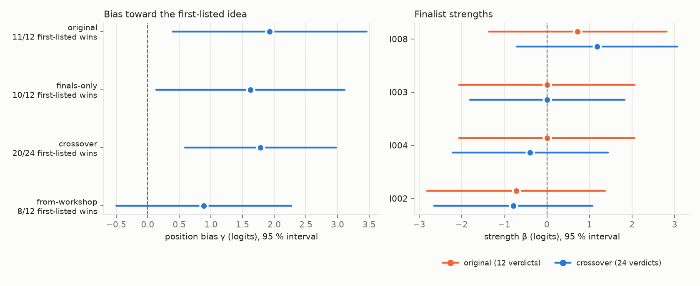

# Judge position bias: controlled reruns of the demo

The recorded demo (`examples/demo-run/`) found that the finals judges preferred whichever idea
was listed first in 11 of 12 verdicts. This study tests the fixes for that and for the other
problems the run exposed, using controlled reruns of the same run. It led to the crossover
finals schedule described in [`DESIGN.md` §5](../DESIGN.md#5-pipeline).

## Method and results (2026-09-29)

Three controlled branches of the recorded run test the fixes for the problems
it exposed. Each branch replays the recording to a phase with
`brainswarm replay --until` and then re-runs the later phases with live agents,
so everything upstream (ideas, critiques, workshop slots, pairs) is
identical. `uv run python examples/rerun_comparison.py` rebuilds all of them
offline from `examples/demo-reruns/` and recomputes the table and figure.

| Condition | What changed | First-listed wins | $\gamma$ (95 % interval) | Order |
|---|---|---|---|---|
| original | — | 11/12 | 1.93 (0.39, 3.46) | I008 > I004 > I003 > I002 |
| finals-only | judge prompt: strengths of both, named winner, cited criterion | 10/12 | 1.62 (0.13, 3.11) | I008 > I004 > I002 > I003 |
| crossover | finals-only plus each model judging the other order (24 verdicts) | 20/24 | 1.78 (0.59, 2.98) | I008 > I003 > I004 > I002 |
| from-workshop | workshop word budget, new judge prompt, crossover schedule | 8/12 | 0.89 (−0.50, 2.27) | I002 > I003 > I004 > I008 |

*The judges' preference for the first-listed idea is real, and the prompt
change did not remove it. Left: the fitted position bias $\gamma$ per
condition (dot) with its 95 % Laplace interval; the dashed line is no bias,
and $\gamma = 1.8$ means two equal ideas are split 86 : 14 in favour of the
one listed first. Right: finalist strengths $\beta$ fitted on the same four
cards from the original 12 verdicts (orange) and the 24 crossover verdicts
(blue). The intervals overlap everywhere, so no finalist is separable from
another on these cards.*

**Position bias.** In the crossover, each model saw both orders of every
pair (in different dispatches) and changed its winner with the order in 4 of
6 pairs, for Sonnet and Opus alike. Under no bias, 20 or more first-listed
wins out of 24 has probability
$\sum_{k=20}^{24}\binom{24}{k}2^{-24} \approx 7.7\times10^{-4}$. The first
finals design sent the two orders of a pair to different models, so with
two judge dispatches it could not tell "each judge prefers the first idea"
from "the judges disagree". The schedule is now a crossover: one model
judges both orders of a pair. In the from-workshop run this gave within-model
contrasts (Sonnet flipped 0 of 3 pairs, Opus 2 of 3) and a smaller $\gamma$
whose interval includes 0. The bias matters most between near-equal ideas:
the only verdicts that survived both orders in the crossover were I008 over
I002 and I008 over I003.

**Workshop.** With a per-field word budget, all four developed cards were
within the 400-word cap at first attempt (338–383 words); the original
workshop sent three back (533, 455 and 694 words). In both workshops every
critique was answered as `fixed` (35 of 35; before, 33 fixed and 1
conceded), so the re-critique's test of whether rebuttals hold was never
used; this is on the watch list ([`DESIGN.md` §15](../DESIGN.md#15-watch-list-known-weak-points)).

**Ranking.** The from-workshop finals put I002 first (rank interval 1–2,
mean win 90 %) and I008 last, the reverse of the original. The ideas are
the same, but their developed cards are new: I002's card changed from
"Stress-Mixture Covariance Sizing with Rank-1 PC1 Stress Prior" to
"Stress-Mixture ERC with Sign-Preserving Stress Prior and Drawdown Taper".
The rank intervals are conditional on the cards; they do not include the
variation between two workshop attempts at the same idea, which here was
larger than the variation between judges. Among four near-equal finalists,
one run's order should not be read as a verdict on the ideas.

**Cost.** Re-running the workshop, re-critique and finals took about 0.43M
new tokens; the finals-only rerun about 0.05M, and the crossover 0.05M.
