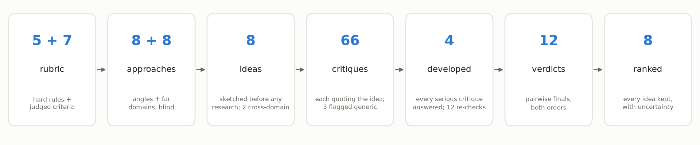
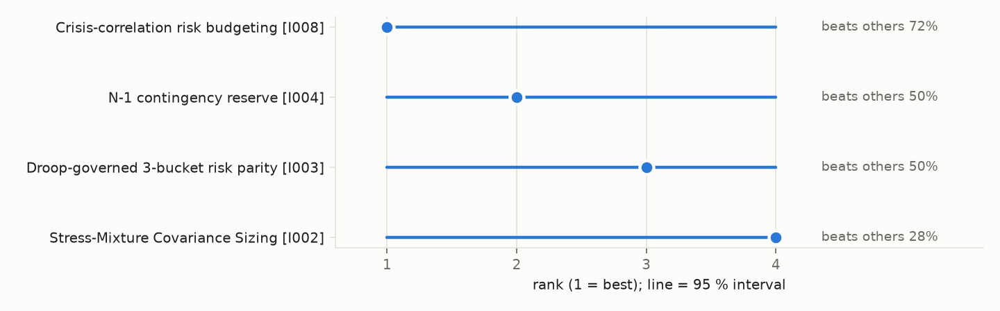

# Examples

A step-by-step tour of one recorded brainswarm run, followed by how to run the demos. Every
number and quotation below comes from the files in `demo-run/`.

| File | What it is |
|---|---|
| `demo-run/` | A recorded live run: brief, config, rubric, every task file and agent output, the code-owned `data/`, and the rendered `report.md` / `report.html` |
| `demo_run.py` | Offline replay: re-runs the code over the recorded agent outputs (zero tokens) and checks the ranking is reproduced exactly |
| `make_figures.py` | Draws the README figures from `demo-run/` |
| `demos/etf-strategy.yaml` | Manifest of the recorded run |
| `demos/home-heating.yaml` | Manifest: cutting home heating energy by 30 % for under $3,000 (not yet run) |
| `demos/exoplanet-transit.yaml` | Manifest: a low-cost exoplanet-transit setup for a 20 cm amateur telescope (not yet run) |
| `demo-reruns/`, `rerun_comparison.py` | Controlled reruns of this run, analysed in [`docs/studies/position_bias.md`](../docs/studies/position_bias.md) |

## Tour of the recorded run (2026-09-29)



*Each box is one stage, left to right, with what it produced; the sections below follow the
same order.*

### 1. Brief and rubric

The brief asked for a rule-based, long-only strategy over 10 liquid ETFs that trades on at
least 3 days a week, keeps weekly turnover at or below 20 %, uses only daily closing prices,
and optimises long-run growth with maximum drawdown below 20 % while staying diversified. The
run used a reduced `quick` size (4 generators, 2 ideas each, 2 critic reviews per idea, 4
development slots) with web research off.

The referee turned the brief into a rubric, and an auditor agent checked it before it was
frozen (15 issues raised; clarifications accepted, numeric weights rejected because the finals
are pairwise). The rubric has two kinds of criteria:

- **Hard rules (gates)**, only those the user stated, plus legality: `long_only_fixed_universe`,
  `trades_three_days_per_week`, `turnover_cap`, `daily_close_data_only`, `legal_and_ethical`.
  An idea that breaks one is marked in the report, never deleted.
- **Judged criteria**: `growth`, `drawdown_control`, `diversification`, `robustness`,
  `constraint_fit`, `specificity`, `novelty`.

### 2. Approaches and far domains

Before any idea was written, each generator proposed approach angles and "far domains" (fields
with nothing to do with finance) without seeing the others'. Examples:

- *Angle:* "Treat the 20 % drawdown limit as a consumable budget that is part of the
  portfolio's state."
- *Angle:* "Make the correlation structure itself the signal."
- *Far domains:* TCP congestion control, fisheries harvest rules, athlete load management,
  reservoir drought rules, the artificial pancreas, **power-grid frequency regulation**.

Code grouped the 16 proposals by how many generators thought of them (common, middle, rare)
and gave each generator one assignment: two got a middle-band angle, one got a rare far domain
(power-grid regulation), and one had a free choice.

### 3. Ideas, sketched blind, then developed

Each generator sketched 2 ideas **before any research**, a pre-registration that stops
research from pulling every idea toward the most-cited answer, then turned them into full idea
cards (mechanism, rationale, assumptions, failure modes, cheapest test, operational spec).

| Idea | Assignment | Title |
|---|---|---|
| I001 | angle (middle) | Absorption-ratio throttle on an inverse-volatility book |
| I002 | angle (middle) | Stress-mixture covariance sizing with a rank-1 stress prior |
| I003 | far domain (rare) | Droop-governed risk parity |
| I004 | far domain (rare) | N-1 contingency reserve |
| I005 | angle (middle) | Effective-bets throttle with a daily turnover budget |
| I006 | angle (middle) | Down-day correlation gap ladder on three trade days |
| I007 | free | Grossman–Zhou cushion sizing of a 3-bucket risk-parity core |
| I008 | free | Crisis-correlation risk budgeting |

The two power-grid ideas, I003 and I004, borrow grid engineering directly: a "droop" law that
cuts exposure in proportion to the drawdown, and a reserve large enough to survive losing the
largest asset-class cluster, as grids keep a reserve against losing their largest generator.

### 4. Critique

Critics reviewed anonymised cards in small overlapping batches: 66 critiques in all. Every
critique quotes the text it attacks (code checks the quote), explains the mechanism, gives
evidence, a severity, and what would prove the critic wrong. An example, on I004:

> **Target:** "Within cluster: inverse 63-day vol, halved if close < 200-day SMA, renormalized."
>
> **Mechanism:** Renormalizing within the cluster cancels the halving whenever every asset in
> the cluster is below its 200-day SMA, which is exactly the bear-market state. Weights then
> revert to plain inverse-vol. […]
>
> **Evidence:** Arithmetic. Five equity ETFs all below their SMA each get 0.5·v_i, and the sum
> is renormalized to 1, so the weights equal the unfiltered inverse-vol weights. […]
>
> **Severity:** major. **Would be refuted by:** a backtest showing the filter changes
> drawdown materially in 2008 or 2022.

A checker agent then applies a substitution test to every critique: would it fit any other
idea unchanged? Three were flagged as generic and carry no weight. (On inspection, at least one
of the three contains idea-specific arithmetic, so the test can over-flag.)

Critics also ranked their batch. The preliminary ranking put the two rare-domain ideas first:
I004, then I003.

### 5. Development

Four ideas were developed ("workshopped") by a different model from their author: three for
high preliminary value (I004, I003, I008) and one as a wildcard, the most novel remaining idea
(I002). The developer must answer every serious critique as fixed, rebutted or conceded. On the
critique above: *"Agreed: renormalisation cancelled the filter. Trend now halves weights
without renormalising, so freed weight goes to cash."* Fresh critics then re-checked the
developed versions (12 re-checks); they judged this fix holds and found no idea had drifted
into a different one.

### 6. Finals and report

The 4 developed ideas met in pairwise finals, each pair judged in both presentation orders (12
verdicts), and a statistical model turned the verdicts into ranks with 95 % intervals.



*Each row is a finalist; the dot is its rank (1 = best) and the line its 95 % interval. On the
right is its estimated chance of beating a randomly chosen other finalist. Every interval spans
ranks 1 to 4, so the report says the four cannot be separated at this size, with weak evidence
for I008.*

The judges showed a strong bias toward whichever idea was listed first (11 of 12 verdicts).
The model estimates that bias and removes it from the strengths, which is why the result is
"not separable" rather than a false winner; a later study changed the finals design so the
bias can be measured more cleanly ([`position_bias.md`](../docs/studies/position_bias.md)).

### 7. What you receive

- **`digest.txt`**: a few lines for the chat: the top idea families with rank intervals, the
  wildcards shown, token use, and the main limitations.
- **`report.md` / `report.html`**: every idea with its full critique record, how each
  critique was answered, gate status, preliminary and final rankings, and the limitations.
- **Export bundles** (`brainswarm export`): for a chosen idea, `idea.md`, `hypotheses.md`, an
  implementation brief and a draft `agent-evolve.yaml`, ready for agent-evolve to build and
  measure.
- **The idea library**: this run's ideas, available to the next run in the same project.

The digest of this run, abridged:

```
Top families:
1. Crisis-correlation risk budgeting ... [I008-v2]: rank 1 (95% 1-4), mean win 72%
2. N-1 contingency reserve ... [I004-v2]: rank 2 (95% 1-4), mean win 50%
3. Droop-governed 3-bucket risk parity ... [I003-v2]: rank 3 (95% 1-4), mean win 50%
4. Stress-Mixture Covariance Sizing ... [I002-v2]: rank 4 (95% 1-4), mean win 28%
Wildcards:
- Down-day correlation gap ladder on three trade days [I006]
- Effective-bets throttle with a daily turnover budget [I005]
```

### Run facts

- **Cost:** at least 1.41M new tokens and 6.5M cache reads, from the 35 recoverable transcripts
  of about 40 subagent dispatches (retries included); the referee session is not counted. The
  run first reported 0.90M because the usage count kept one transcript per dispatch id
  (fixed; [`DESIGN.md` §14](../docs/DESIGN.md#14-logging-and-telemetry)). Early phases used
  general-purpose subagents because the role agents had not yet loaded in this cloud session;
  those cost about 55k tokens per dispatch against 12–35k for the role agents.
- **Problems the run exposed, all since fixed with regression tests:** critics who ranked all
  4 cards instead of their top 3 were rejected (longer rankings are now truncated); ideas with
  *fixable* gate citations were excluded from the finals as if barred (the run was rolled back
  to the start of the finals and continued); three developed cards exceeded the 400-word cap
  (the workshop now gets a per-field word budget); and the judges' position bias (see above).

## Running the demos

```bash
uv run python examples/demo_run.py        # offline, zero tokens, ~5 s
```

Live (in Claude Code, after installing): say "run the brainswarm demo", or
`brainswarm init --manifest examples/demos/<name>.yaml`, and follow `/brainswarm`. All three
manifests use the same reduced `quick` size as the recorded run, so each should cost about
1.4M new tokens. The two unrun briefs were chosen because their outcomes can be checked with
arithmetic rather than taste: photometric scatter per time bin for the transit setup, and
heat loss ($Q = UA\,\Delta T$ summed over heating degree-days) for the house. They therefore
test whether critics catch quantitative errors, which the trading brief could not.
